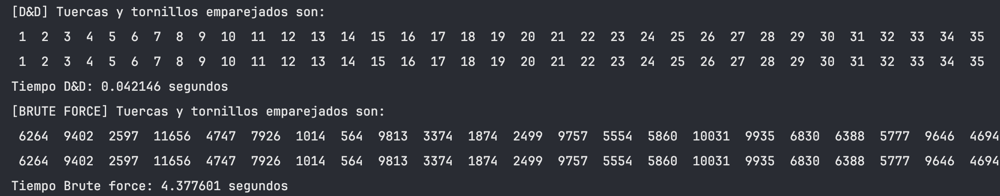

<div align="center">
  <h1>Nuts and Bolts problem solver</h1>
</div>
<div align="center">
  
</div>

## Descripción

Este script ha sido desarrollado como parte de una entrega para la asignatura de Diseño de Algoritmos, especialidad en Computación, en la Facultad de Informática de Donostia-San Sebastián (UPV/EHU). La idea es complementar la parte teórica y pseudocódigo proporcionados en la entrega, mediante la resolución del problema de las tuercas y los tornillos (Nuts and Bolts Problem), aplicando una variante del algoritmo Quick Sort.

La implementación se basa y adapta de una solución propuesta en GeeksforGeeks, extendiéndola para incluir medición de tiempos de ejecución y un método de fuerza bruta.

Fuente: [GeeksforGeeks - Nuts & Bolts Problem](https://www.geeksforgeeks.org/nuts-bolts-problem-lock-key-problem-using-quick-sort/)

## Características

- **Algoritmo Quicksort:** Variante adaptada para resolver el problema de las tuercas y los tornillos de manera eficiente.
- **Medición de tiempos de ejecución:** Funcionalidad incorporada para evaluar el rendimiento del algoritmo.
- **Método de fuerza bruta:** Incluye un enfoque alternativo para la resolución del problema, para realizar comparaciones y análisis de eficiencia.

## Uso

```bash
# ejecutar el script (cambiar el tamaño de los vectores en el código) 
python nuts_and_bolts_solver.py
```

## Output de ejemplo

<div align="center">
  
</div>
